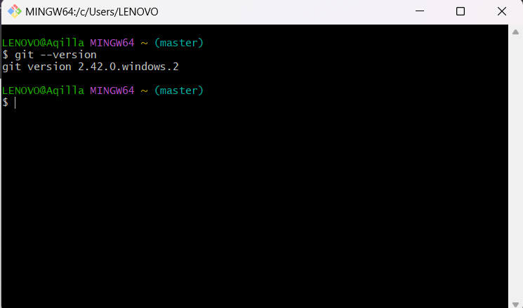
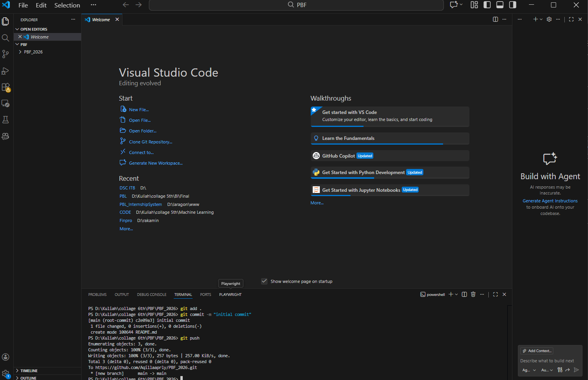
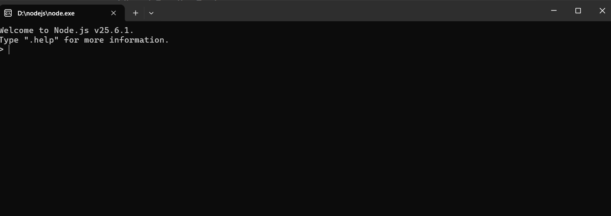
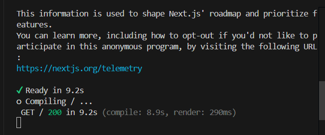
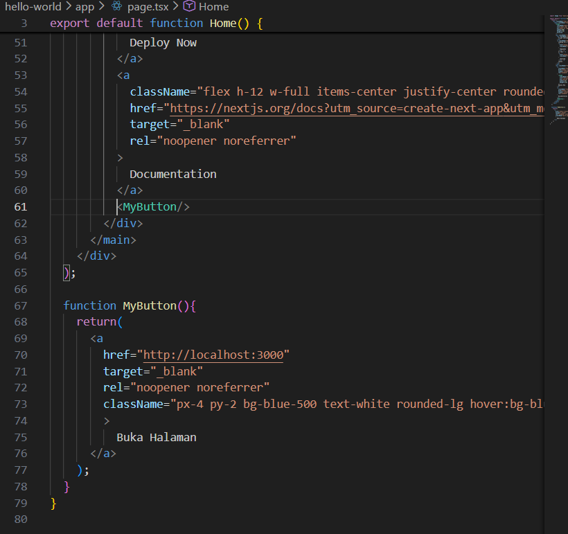
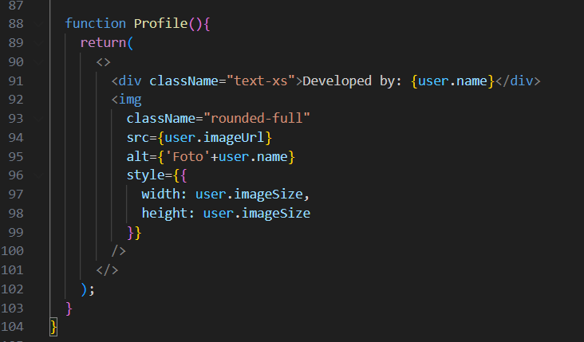
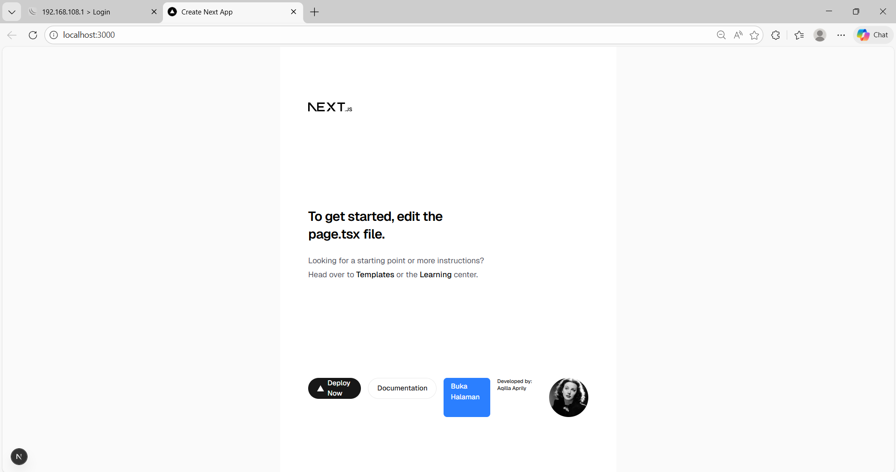

This is a [Next.js](https://nextjs.org) project bootstrapped with [`create-next-app`](https://nextjs.org/docs/app/api-reference/cli/create-next-app).

## Getting Started

First, run the development server:

```bash
npm run dev
# or
yarn dev
# or
pnpm dev
# or
bun dev
```

Open [http://localhost:3000](http://localhost:3000) with your browser to see the result.

## Practicum Report

|  | Pemrograman Berbasis Framework 2026 |
|--|--|
| NIM |  2341720068|
| Nama |  Aqilla Aprily Kurnia Sari |
| Kelas | TI - 3I |

### Practicum 1
#### 1. Explain the function of each of the following tools: Git, VS Code, and Node.js, that you installed during this practical session.
#### **1. Git**
Git is a distributed version control system used to track changes in source code during software development.
##### Main Functions:
- Tracks changes in project files
- Manages different versions of a project
- Supports collaboration through branching and merging
- Allows reverting to previous versions if errors occur

Git ensures that project development is organized, secure, and well-documented.

#### **2. Visual Studio Code (VS Code)**
Visual Studio Code (VS Code) is a lightweight and powerful source code editor used for writing and managing code.

##### Main Functions:
- Provides syntax highlighting for multiple programming languages
- Supports extensions for frameworks and tools
- Includes an integrated terminal
- Offers debugging and formatting tools

VS Code improves productivity by making coding more efficient and structured.

#### **3. Node.js**
Node.js is a JavaScript runtime environment that allows JavaScript to run outside of a web browser.

##### Main Functions:
- Runs JavaScript on the server side
- Manages project dependencies using npm (Node Package Manager)
- Runs development servers for frameworks like Next.js
- Supports backend application development

In this practical session, Node.js is used to run and manage the Next.js development environment.

### 2. Provide proof in the form of screenshots showing that each of these tools has been successfully installed on your device.
#### 1. Git Installation


#### 2. VSC Installation


#### 3. Node Installation


### Practicum 2
#### 1. In Step 2, after creating a new project using Next.js, several terms appear. Explain the following terms: TypeScript, ESLint, Tailwind CSS, App Router, Import Alias, App Router, and Turbopack.

During the creation of a new Next.js project, several configuration options appear. Below are the explanations of those terms:

#### -TypeScript
TypeScript is a superset of JavaScript that adds static typing.  
It helps detect errors early, improves code maintainability, and enhances code readability, especially in large-scale applications.

#### -ESLint
ESLint is a static code analysis tool used to identify and fix problems in JavaScript or TypeScript code.  
It enforces coding standards and improves overall code quality.

#### -Tailwind CSS
Tailwind CSS is a utility-first CSS framework used to design user interfaces quickly.  
It provides predefined utility classes that allow developers to style components directly in JSX or HTML.

#### -App Router
App Router is the routing system introduced in Next.js 13 and above.  
It uses the `app/` directory to define routes, layouts, and nested routing structures.

#### -Import Alias
Import Alias simplifies long relative import paths.

Example without alias:
```js
import Button from "../../../components/Button";
```

Example with alias:
```js
import Button from "@/components/Button";
```

This improves readability and project organization.

#### -Turbopack
Turbopack is a modern bundler developed by Vercel.  
It is designed to provide faster builds and improved development performance compared to traditional bundlers like Webpack.

#### 2. What are the functions of the folders and files in the React project structure shown in the image during Experiment Stage 3?

Below are the functions of the main folders and files in a Next.js (React) project:

#### -app/
Contains application routes using the App Router system.
- `page.tsx` → Main homepage component.
- `layout.tsx` → Shared layout for all pages.
- `globals.css` → Global styles for the application.

#### -public/
Stores static assets such as images, icons, and fonts.  
Files inside this folder can be accessed directly via URL.

#### -node_modules/
Contains all installed dependencies and libraries required by the project.  
Automatically generated after running `npm install`.

#### -package.json
Contains project metadata, dependencies, and available scripts (e.g., `npm run dev`).

#### -package-lock.json
Locks dependency versions to ensure consistent installations across environments.

#### -tsconfig.json
Configuration file for TypeScript compiler settings.

#### -next.config.js / next.config.ts
Used to configure and customize Next.js behavior.

#### -.gitignore
Specifies files and folders that Git should ignore (e.g., `node_modules`).

#### 3. Provide proof in the form of screenshots showing that you have successfully completed the experimental steps above.



### Practicum 3
#### 1. Provide proof in the form of screenshots showing that you have successfully completed the experimental steps above.



### Practicum 4
#### 1. What is the purpose of the syntax user.imageUrl?
The syntax `user.imageUrl` is used to access a specific property from a JavaScript object.

In this case:

```js
const user = {
  name: "Aqilla Aprily",
  imageUrl: "https://i.imgur.com/yXOvdOSs.jpg",
  imageSize: 90,
};
```

- `user` is an object.
- `imageUrl` is one of its properties.

When we write:

```js
user.imageUrl
```

it means we are accessing the value of the `imageUrl` property inside the `user` object.

#### Function in the Program

In the React component:
```jsx

```

The syntax `user.imageUrl` is used to dynamically display the image URL stored in the object.  
This allows the image source to be managed from a single data object instead of being hardcoded directly in the JSX.

#### Why It Is Important
- Improves code readability
- Makes the component reusable
- Allows dynamic data rendering
- Keeps data and UI structured

#### 2. Provide proof in the form of screenshots showing that you have successfully completed the experimental steps above.

